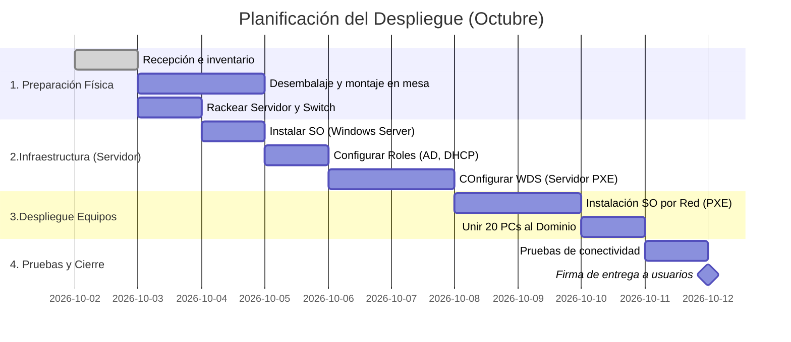

# Proyecto: Despliegue de Nuebo Hardware (Fase 1)   

Este documento detalla la planificación y el inventario para la actualización de los equipos del departamento de Administración y la sala de servidores.   

> **Gestión de Residuos**: Los equipos antiguos que sean retirados deben almacenarse temporalmente en el almacén 2. No se deben desechar hasta que se haya completado el borrado seguro de los discos duros (Wipe)   
>
### Inventario de Hardware Recibido   

Antes de iniciar el despliegue, el técnico encargado debe verificar que los albaranes coinciden con el siguiente material:   

| **Referencias** | **Tipo de dispositivo** | **Cantidad** | **Especificaciones Principales** | **Destino** |
|:----------------|:------------------------|--------------|:---------------------------------|:------------|
| **SRV-01** | Servidor Rack 2U | 1 | Intel Xeon, 64GB RAM, RAID 5(4x2TB) | Rack Principal |
| **PC_ADM** | Equipo Sobremesa  | 20 | Intel Core i5, 16 GB RAM, 512 GB NVMe | Administración |
| **SW-02** | Switch Gestionable | 1 | 24 Puertos Gigabit, PoE+ | Rack Secundario |   

> Las licencias de Windows 11 Pro para los quipos de sobremesa ya están inyectadas en la BIOS (OEM). No es necesario introducir clabes manualmente.   
>
### Cronograma de Proyeto (Diagrama de Gantt)   

### Checklist de Despliegue   

Para cada lote de 5 ordenadores, el técnico debe marcar las siguientes tareas como completadas:   

- [x] Retirar plásticos y cajas al contenedor de reciclaje.
- [ ] Conectar cableado eléctrico y cable de red (UTP Cat6).
- [ ] Modificar la BIOS para arrancar desde la red (PXE/IPv4).
- [ ] Verificar que el equipo recibe IP del servidor DHCP.
- [ ] Comprobar acceso a la carpeta compartida \\SRV-01\\Publico 
