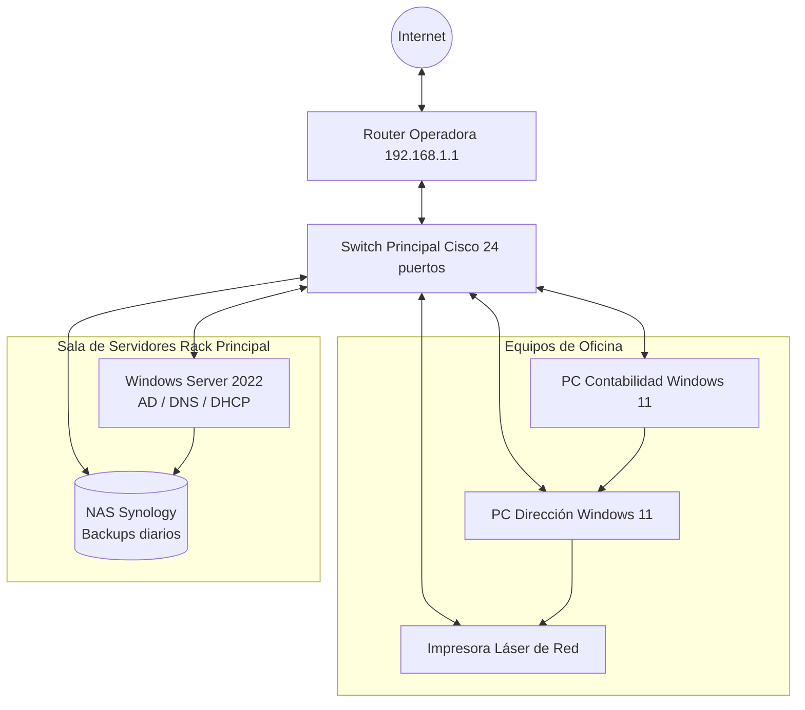

# Infraestructura de Red Local "TechPYME"

Documentación técnica de la nueva infraestructura de red. Este proyecto es **altamente crítico** para el funcionamiento de la empresa y cualquier cambio en los servidores debe hacerse con *extrema precaución*

> [!Warning]   
> **Ventana de Mantenimiento:** Cualquier reinicio de switch principal o del router de la operadora debe realizarse estricatamente fuera del horario laboral (después de las 18:00h) para evitar la desconexión de los equipos de Contabilidad y Dirección.

   

Para más detalles sobre los estándares de cableado estructurado aplicados, puedes consultar la normativa de la [Asociacion de la Industria de Telecomunicaciones (TIA)](https://www.tiaonline.org/)   

## Topología de la Red  

A continuación se presenta un diagrama de arquitectura de la red local, mostrando la conexión desde el exterior hasta los equipos finales:




## Configuración de Servidor (PowerShell)   

Para que el servidor Windows Server actúe correctamente dentro del dominio, necesita una dirección IP estática. Hemos automatizado este proceso con el siguiente bloque de código:   

```CSS
# Script para configurar una IP estática en la interfaz principal   
$IP = "192.168.1.10"   
$Mascara = 24   
$PuertaEnlace = "192.168.1.1"   

Write-Host "Configurando el adaptador de red..."
New-NetIPAddress -InterFaceAlias "Ethernet" -IPAddress $IP -PrefixLenght $Mascara -DefaultGateway $PuertaEnlace

# Configurar el propio servidor como DNS primario (LocalHost)
Set-DnsClientServerAddress -Interfacealias "Ethernet" -ServerAddresses "127.0.0.1"
```

## Tabla de Direccionamiento IP (IPv4)

A continuación, se detalla la asignación de direcciones para los dispositivos estáticos de la red (el resto de equipos reciben IP por DHCP)

   
| Equipo/Dispositivo | Dirección IP | Máscara de Subred | Función Principal |
|:-------------------|--------------|-------------------|:------------------|
| Router Operadora | 192.168.1.1 | /24 (255.255.255.0) | Puerta de enlace (Gateway) |
| Windows Server | 192.168.1.10 | /24 (255.255.255.0) | Controlador de Dominio y DNS |
| NAS Synology | 192.168.1.15 | /24 (255.255.255.0) | Almacenamiento en red y Copias |
| Impresora Oficina | 192.168.1.20 | /24 (255.255.255.0) | Impresión compartida |